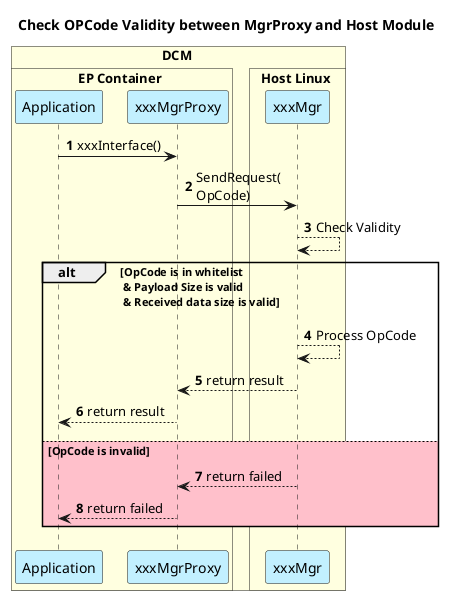
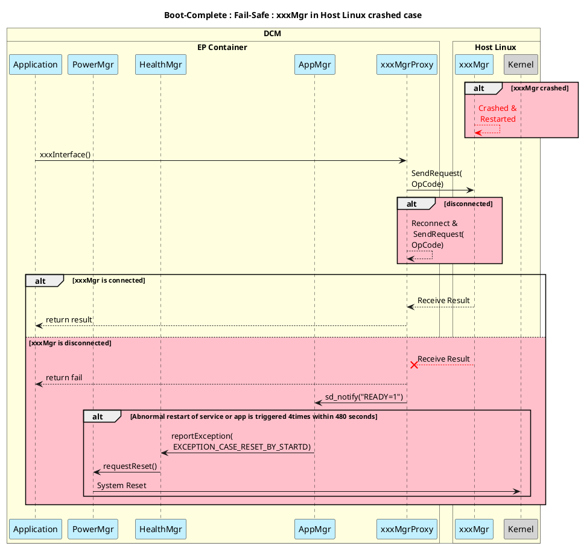
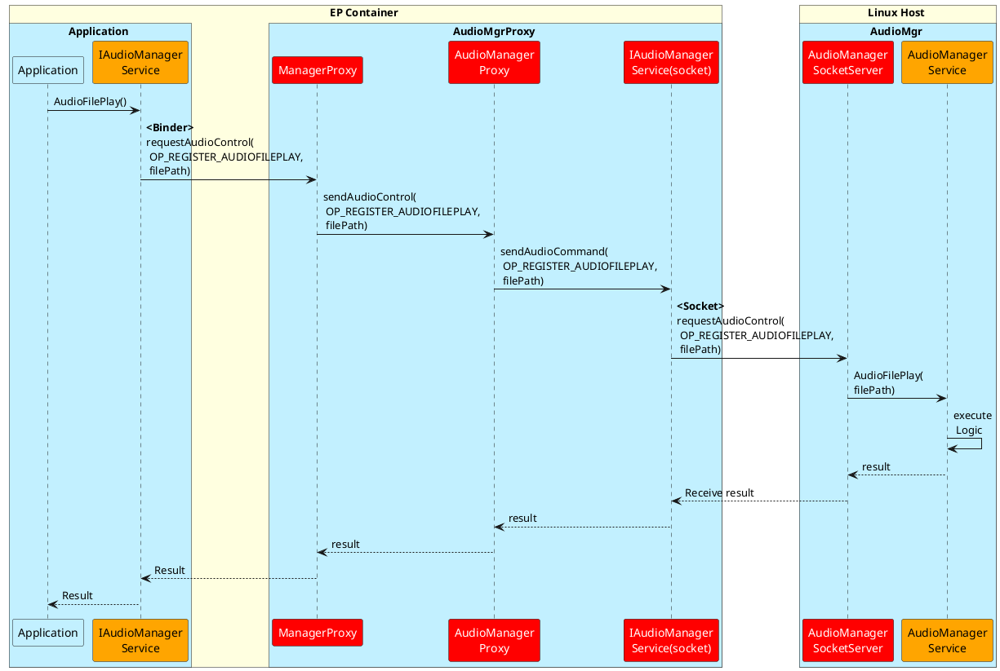

# 06. (24LM) Thiết kế cho module trong Linux Host

> Nguồn: Confluence DCMNTCY — trang 3688463772. Bản dịch tiếng Việt; giữ nguyên diagram PlantUML, code và thuật ngữ kỹ thuật tiếng Anh.
>
> Link gốc: http://collab.lge.com/main/spaces/DCMNTCY/pages/3688463772/06.+24LM+Design+for+module+in+the+Linux+Host

## 1. Tổng quan (Overview)

- Cần có fail-safe cho các module Linux Host.
- Cần cân nhắc boot-complete cùng với các module Linux Host.

## 2. Kiến trúc phần mềm (SW Architecture)

_(Sơ đồ "Host Linux Module Architecture" — đính kèm trong trang gốc)_

## 3. Sequence Diagram

### 3.1 Trường hợp bình thường: Kiểm tra tính hợp lệ của OpCode giữa MgrProxy và Host Module



### 3.2 Boot-Complete: trường hợp xxxMgr trong Linux Host đã boot

```plantuml
title: Boot-Complete : xxxMgr in Linux Host booted case
autonumber
!pragma teoz true
box DCM #lightyellow
box EP Container #lightyellow
participant "AppMgr(StartD)" as AM #application
participant "xxxMgrProxy" as XMP #application
end box
box Linux Host #lightyellow
participant "xxxMgr" as XM #application
participant "Kernel" as KL #lightgray
end box
end box
XMP -> XM : connect(\n fd, struct sockaddr,\n sizeof(addr))
XM --> XM : fd = socket(\n AF_UNIX, SOCK_STREAM, 0)
XM --> XM : bind(fd,\n addr, sizeof(addr))
XMP <- XM : return Success(>=0)
AM <- XMP : sd_notify(0, "READY=1");
...
== BOOT_COMPLETE_PRE ==
AM --> AM : broadcastSystemPost(\n SYS_POST_BOOT_COMPLETED_PRE)
@enduml
```

### 3.3 Fail-Safe: trường hợp xxxMgr trong Linux Host bị crash



**Diễn giải fail-safe:** Nếu `xxxMgr` bị crash và restart, `xxxMgrProxy` phát hiện đứt kết nối và thực hiện Reconnect rồi gửi lại request. Nếu vẫn không kết nối được, Proxy trả về fail cho Application và gọi `sd_notify("READY=1")`. Trường hợp abnormal restart của service/app xảy ra **4 lần trong vòng 480 giây**, HealthMgr được báo lỗi (`EXCEPTION_CASE_RESET_BY_STARTD`) → yêu cầu PowerMgr `requestReset()` → System Reset.

## 4. Thiết kế chi tiết (Detailed Design)

### 4.1 Thiết kế chi tiết phần mềm

_(Sơ đồ "AudioMgrProxy" — đính kèm trong trang gốc)_

### 4.2 Source Tree

```
audio-service/
├── proxy/
│          ├── ManagerProxy.hpp
│          ├── AudioManagerProxy.hpp
│          ├── AudioManagerProxy.cpp
│          ├── ManagerProxy_Main.cpp
│          └── ManagerProxy.cpp
│
├── hal/
├── include/
│   ├── AudioManager.h
│   ├── IAudioManagerReceiver.h
│   ├── IAudioManagerService.h
│   ├── IAudioManagerServiceTypeVariant.h
│   └── IAudioManagerService_socket.h
├── interface/
│   ├── AudioManager.cpp
│   ├── IAudioManagerReceiver.cpp
│   ├── IAudioManagerService.cpp
│   └── interface_socket/
│          ├── IAudioManagerService_socket.cpp
│          └── IManagerService_socket.cpp
├── service/
│   ├── AudioAdaptee.cpp
│   ├── AudioAdaptee.h
│   ├── AudioInputManager.cpp
│   ├── AudioInputManager.h
│   ├── AudioInputManagerVariant.cpp
│   ├── AudioManagerService_main.cpp
│   ├── AudioManagerService.cpp
│   ├── AudioManagerService.h
│   ├── AudioManagerServiceVariant.cpp
│   ├── AudioManagerSocketServer.cpp
│   ├── AudioManagerSocketServer.hpp
│   ├── ManagerSocketServer.cpp
│   └── ManagerSocketSever.hpp
│
└── sldd/
    └── SLDD_audiomanager.cpp
```

### 4.3 Sequence Diagram



### 4.3 Tổng hợp các hạng mục hiện thực

_(Phần này trong trang gốc chưa có nội dung.)_
