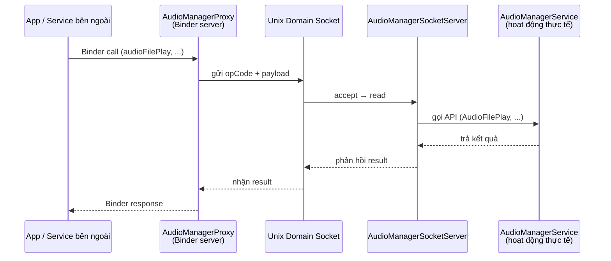
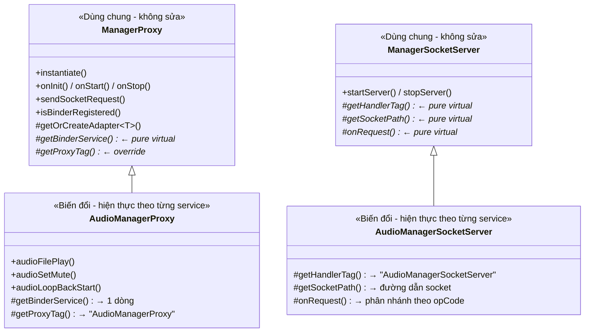
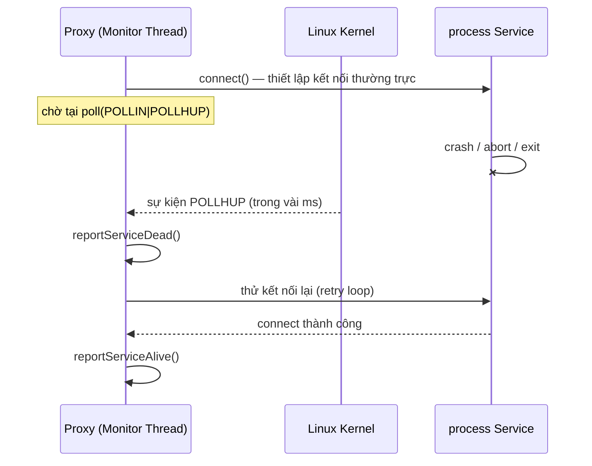
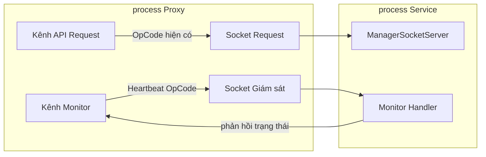

# Hướng dẫn kiến trúc ManagerProxy / ManagerSocketServer

> **Mục đích**: Cấu trúc trong đó service/app bên ngoài gửi request qua Binder IPC → Proxy chuyển tiếp tới Service qua Unix Domain Socket.
> Được hiện thực với Audio làm ví dụ; các service khác (Navigation, Vehicle, v.v.) cũng có thể mở rộng theo **cùng một pattern**.

> Nguồn: Confluence DCMNTCY — trang 3737980512 "(kor) ManagerProxy / ManagerSocketServer 아키텍처 가이드" (bản gốc tiếng Hàn). Bản dịch tiếng Việt, giữ nguyên code và thuật ngữ kỹ thuật tiếng Anh.
>
> Link gốc: http://collab.lge.com/main/spaces/DCMNTCY/pages/3737980512/60.+kor+ManagerProxy+ManagerSocketServer+%EC%95%84%ED%82%A4%ED%85%8D%EC%B2%98+%EA%B0%80%EC%9D%B4%EB%93%9C
> Bản tiếng Anh tương đương (3741825871): http://collab.lge.com/main/spaces/DCMNTCY/pages/3741825871/59.+eng+ManagerProxy+ManagerSocketServer+Architecture+Guide

---

## 1. Cấu trúc tổng thể (Big Picture)



**Tại sao lại dùng cấu trúc này?**

- Process Proxy và process Service được tách thành **hai process riêng biệt**.
- Binder đảm nhiệm giao tiếp giữa client (app bên ngoài) và Proxy; Socket đảm nhiệm giao tiếp giữa Proxy và Service.
- Service chết thì Proxy vẫn sống; Proxy chết thì Service cũng không bị ảnh hưởng.

---

## 2. Phân cấp class — phần dùng chung vs phần biến đổi



### Nguyên tắc cốt lõi

| Phân loại        | Phần dùng chung (không cần sửa)                                               | Phần biến đổi (hiện thực theo từng service)                     |
| ---------------- | ----------------------------------------------------------------------------- | --------------------------------------------------------------- |
| **Phía Proxy**   | `ManagerProxy` — đăng ký Binder, vòng đời (lifecycle), truyền Socket, Handler | `AudioManagerProxy` — định nghĩa API, chuyển đổi opCode/payload |
| **Phía Service** | `ManagerSocketServer` — vòng lặp accept/read/write                            | `AudioManagerSocketServer` — gọi hàm Service theo từng opCode   |
| **main()**       | `ManagerProxy_main.cpp` — copy dùng nguyên xi                                 | `createProxyService()` — 1 dòng ở cuối file cpp của subclass    |

---

## 3. Cấu trúc file (ví dụ Audio)

```
proxy/ ← process Proxy (kết quả build: AudProxy)
├── ManagerProxy_main.cpp ← [Chung] main() — giống nhau cho mọi service
├── ManagerProxy.hpp / .cpp ← [Chung] base class
├── AudioManagerProxy.hpp / .cpp ← [Biến đổi] Proxy riêng cho Audio
├── Makefile.am ← [Biến đổi] cấu hình build target
└── interface/
├── IAudioManagerProxy.hpp ← [Biến đổi] định nghĩa Binder interface
└── IAudioManagerProxyType.hpp ← [Biến đổi] định nghĩa OpCode, struct (protocol)
service/ ← process Service (bổ sung vào service hiện có)
├── ManagerSocketServer.hpp / .cpp ← [Chung] base class Socket server
└── AudioManagerSocketServer.hpp / .cpp ← [Biến đổi] xử lý request riêng cho Audio
```

---

## 4. Vai trò chi tiết của từng file

### 4.1 `ManagerProxy_main.cpp` — dùng chung cho mọi service (không cần sửa)

```cpp
extern ManagerProxy* createProxyService(); // hiện thực trong cpp của subclass
int main() {
ManagerProxy* service = createProxyService(); // tạo concrete type qua factory
service->instantiate(); // đăng ký Binder
service->onInit(); // khởi tạo
service->onStart(); // khởi động
android::IPCThreadState::self()->joinThreadPool(); // vào vòng lặp Binder
}
```

> **Q: `extern createProxyService()` được hiện thực ở đâu?**
> A: Được hiện thực ở **cuối cùng** trong file `.cpp` của subclass mỗi service. (Xem mục 4.3 bên dưới)

### 4.2 `ManagerProxy` — base class dùng chung (không cần sửa)

Các tính năng đã được hiện thực sẵn:

- **Đăng ký Binder** (`instantiate`) — gọi `getBinderService()` để đăng ký Binder của subclass.
- **Quản lý vòng đời** (`onInit`, `onStart`, `onStop`) — tự động gọi các hook của subclass.
- **Giao tiếp Socket** (`sendSocketRequest`) — subclass chỉ cần truyền opCode/payload.
- **Tự động tạo Adapter** (`getOrCreateAdapter<T>()`) — tạo Binder adapter chỉ bằng 1 dòng.

### 4.3 `AudioManagerProxy` — phần biến đổi (hiện thực theo từng service)

```cpp
// 1) Constructor — chỉ truyền tên service
AudioManagerProxy::AudioManagerProxy()
: ManagerProxy(AudioManagerProxy::getServiceName()) {}
// 2) Binder service — 1 dòng bằng getOrCreateAdapter
android::IBinder* AudioManagerProxy::getBinderService() {
return getOrCreateAdapter<BnAudioManagerProxyAdapter>();
}
// 3) Hiện thực API — đưa dữ liệu vào struct rồi gọi sendSocketRequest
error_t AudioManagerProxy::audioFilePlay(const std::string& filePath) {
AudioManagerSocket::FilePlayRequest req = {};
std::memcpy(req.filePath, filePath.c_str(), copyLen);
// chuyển thành payload rồi gửi
return sendSocketRequest(SOCKET_PATH, OP_FILE_PLAY, payload);
}
// 4) Hàm factory — 1 dòng ở cuối file
ManagerProxy* createProxyService() {
return new AudioManagerProxy();
}
```

### 4.4 `IAudioManagerProxyType.hpp` — định nghĩa Socket protocol

Cả hai phía Proxy ↔ Service cùng tham chiếu **cùng một header** để đảm bảo protocol nhất quán.

```cpp
namespace AudioManagerSocket {
static constexpr const char* SOCKET_PATH = "/data/audio/proxy_audio_service.sock";
enum class OpCode : uint32_t {
OP_FILE_PLAY = 2U,
OP_SET_MUTE = 3U,
// ...
};
struct FilePlayRequest { char filePath[256]; } __attribute__((packed));
struct SetMuteRequest { uint8_t spkMute; uint8_t micMute; uint8_t srvType; };
}
```

### 4.5 `AudioManagerSocketServer` — phần biến đổi phía Service

Bổ sung Socket server vào service hiện có. Chỉ cần hiện thực phần phân nhánh opCode trong `onRequest()`:

```cpp
int32_t AudioManagerSocketServer::onRequest(uint32_t opCode, const std::vector<uint8_t>& payload) {
switch (static_cast<AudioManagerSocket::OpCode>(opCode)) {
case OpCode::OP_FILE_PLAY: {
// payload → chuyển thành struct
return mService.AudioFilePlay(filePath, NONE);
}
case OpCode::OP_SET_MUTE: { /* ... */ }
// ...
}
}
```

---

## 5. Checklist thêm một Service Proxy mới

Ví dụ: giả sử tạo **NavigationManagerProxy**.

### Step 1: Phía Proxy (4 file)

| #   | File                              | Việc cần làm                                                                                                    |
| --- | --------------------------------- | --------------------------------------------------------------------------------------------------------------- |
| 1   | `INavigationManagerProxyType.hpp` | Định nghĩa `SOCKET_PATH`, `OpCode`, các struct request bên trong `namespace NavigationManagerSocket`            |
| 2   | `INavigationManagerProxy.hpp`     | Binder interface — khai báo các hàm API pure virtual                                                            |
| 3   | `NavigationManagerProxy.hpp`      | Kế thừa `ManagerProxy` + `INavigationManagerProxy`, khai báo API                                                |
| 4   | `NavigationManagerProxy.cpp`      | Constructor, `getBinderService()` 1 dòng, hiện thực `sendSocketRequest()` theo từng API, `createProxyService()` |

### Step 2: Phía Service (1 file)

| #   | File                                     | Việc cần làm                                                                                        |
| --- | ---------------------------------------- | --------------------------------------------------------------------------------------------------- |
| 5   | `NavigationManagerSocketServer.hpp/.cpp` | Kế thừa `ManagerSocketServer`, phân nhánh theo opCode trong `onRequest()` → gọi hàm Service hiện có |

### Step 3: Thêm lệnh khởi động server vào main của Service hiện có (1 dòng)

```cpp
// Trong onStart() hoặc hàm tương tự của NavigationManagerService.cpp
mSocketServer = std::make_unique<NavigationManagerSocketServer>(*this);
mSocketServer->startServer();
```

### Step 4: Copy main() nguyên xi

Copy `ManagerProxy_main.cpp` nguyên xi. Copy luôn `ManagerProxy.hpp/.cpp` nguyên xi.
`createProxyService()` đã được hiện thực sẵn ở cuối file số 4 của Step 1.

### Step 5: Makefile.am

```makefile
bin_PROGRAMS = NavProxy
NavProxy_SOURCES = \
ManagerProxy_main.cpp \
ManagerProxy.cpp \
NavigationManagerProxy.cpp
```

---

## 6. Lưu ý khi hiện thực

### Nhất quán Socket protocol

- OpCode và struct trong `IAudioManagerProxyType.hpp` phải được cả hai phía Proxy/Service tham chiếu **giống hệt nhau**.
- Bắt buộc gắn `__attribute__((packed))` vào struct để tránh khác biệt về byte alignment.

### Binder Adapter (BnAdapter)

- Dùng macro `PROXY_DELEGATE_N` thì việc ủy quyền Binder→Proxy hoàn thành chỉ bằng 1 dòng cho mỗi API.
- Số trong macro là số lượng tham số: `PROXY_DELEGATE_0` (không tham số), `PROXY_DELEGATE_1` (1 tham số), ...

### Xử lý lỗi

- Nếu `sendSocketRequest()` trả về `-1` nghĩa là kết nối Socket thất bại (ví dụ Service chưa chạy).
- Có thể dùng `isBinderRegistered()` để kiểm tra việc đăng ký Binder có thất bại hay không (đã được kiểm tra sẵn trong main).

### Lifecycle Hook (tùy chọn)

Override trong subclass nếu cần:

- `onProxyInit()` — công việc bổ sung tại thời điểm khởi tạo.
- `onProxyStarted()` — công việc bổ sung tại thời điểm khởi động.
- `onConnectMessage()` — xử lý message của Handler.

---

## 7. Giám sát vòng đời của Service

Trong cấu trúc hiện tại, Proxy chỉ biết được trạng thái kết nối của Service khi gọi `sendSocketRequest()`.
Tuy nhiên có yêu cầu phải phát hiện **ngay lập tức** khi Service chết do crash/abort, nên dự kiến bổ sung hai phương án dưới đây.

### 7.1 Phương án A: Persistent Connection + Disconnect Detection (khuyến nghị)

Duy trì một **socket kết nối thường trực** tới Service, và phát hiện việc Service chết bằng `POLLHUP` vào thời điểm kernel dọn dẹp socket.



**Hiện thực phía Proxy (bổ sung vào phần dùng chung `ManagerProxy`)**:

```cpp
// Bên trong ManagerProxy — mọi Proxy tự động có tính năng giám sát Service
class ServiceMonitor {
int mPersistentFd = -1; // socket kết nối thường trực
std::thread mMonitorThread;
void monitorLoop() {
while (running) {
if (mPersistentFd < 0) {
mPersistentFd = connectToService();
if (mPersistentFd < 0) {
reportServiceDead();
retryAfterDelay();
continue;
}
reportServiceAlive();
}
// giám sát trạng thái kết nối bằng poll()
struct pollfd pfd = {mPersistentFd, POLLIN | POLLHUP, 0};
int ret = poll(&pfd, 1, kHeartbeatIntervalMs);
if (pfd.revents & (POLLHUP | POLLERR)) {
// process Service kết thúc → phát hiện đứt socket ngay lập tức
close(mPersistentFd);
mPersistentFd = -1;
reportServiceDead();
} else {
// bình thường → gửi heartbeat cho Health
HeartBeat();
}
}
}
};
```

| Mục                     | Nội dung                                                                           |
| ----------------------- | ---------------------------------------------------------------------------------- |
| **Nguyên lý phát hiện** | Khi process crash/exit, kernel dọn dẹp socket FD → phát sinh `POLLHUP`             |
| **Tốc độ phát hiện**    | Trong vài ms (dựa trên sự kiện kernel, không phụ thuộc chu kỳ polling)             |
| **Ưu điểm**             | Bản thân kết nối là bằng chứng liveness, không cần Ping, phản ứng tức thời         |
| **Nhược điểm**          | Chiếm thường trực 1 socket (tách biệt với socket dùng cho request chức năng)       |
| **Chung/Biến đổi**      | Hiện thực trong **phần dùng chung** (`ManagerProxy`) — subclass không cần làm thêm |

### 7.2 Phương án B: Dual-Channel (tách Điều khiển + Giám sát)

Tách riêng kênh request chức năng và kênh giám sát, đồng thời phân loại chi tiết trạng thái Service ở mức protocol.



**Mở rộng protocol (bổ sung vào `IXxxManagerProxyType.hpp`)**:

```cpp
// Thêm các code liên quan vòng đời vào OpCode hiện có
enum class OpCode : uint32_t {
OP_PING = 1U,
OP_FILE_PLAY = 2U,
// ...OpCode hiện có...
// ─── Giám sát vòng đời (dải 100) ───
OP_HEARTBEAT_REQ = 100U, // Proxy → Service: còn sống không?
OP_HEARTBEAT_RSP = 101U, // Service → Proxy: còn sống + thông tin trạng thái
OP_SERVICE_READY = 102U, // Service → Proxy: thông báo khởi tạo xong
OP_SERVICE_SHUTDOWN = 103U, // Service → Proxy: báo trước sẽ tắt bình thường
};
// Phân loại chi tiết trạng thái service
struct HeartbeatResponse {
uint32_t state; // INIT / RUNNING / DEGRADED / SHUTTING_DOWN
uint32_t uptimeSec; // thời gian service đã chạy
uint32_t pendingRequests; // số request đang xử lý
} __attribute__((packed));
```

| Mục                     | Nội dung                                                                                                  |
| ----------------------- | --------------------------------------------------------------------------------------------------------- |
| **Nguyên lý phát hiện** | Heartbeat định kỳ + truy vấn trạng thái trên kênh chuyên dụng                                             |
| **Ưu điểm**             | Request chức năng và giám sát độc lập nhau; có thể biểu diễn chi tiết trạng thái service (DEGRADED, v.v.) |
| **Nhược điểm**          | Tăng độ phức tạp, dùng 2 socket, độ trễ phát hiện phụ thuộc chu kỳ Heartbeat                              |

---
